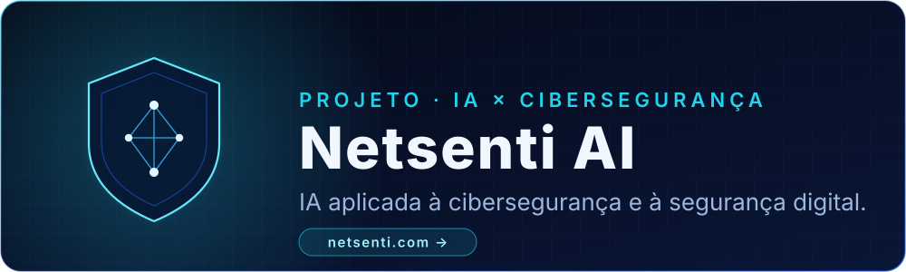
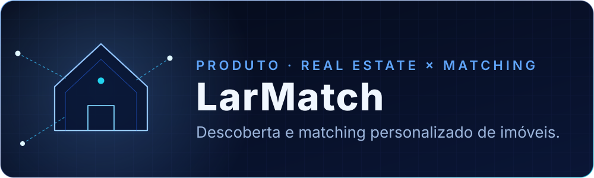

  <picture>
    <source media="(max-width: 640px) and (prefers-reduced-motion: reduce)" srcset="assets/flayks-hero-mobile-static.svg">
    <source media="(max-width: 640px)" srcset="assets/flayks-hero-mobile.svg">
    <source media="(prefers-reduced-motion: reduce)" srcset="assets/flayks-hero-static.svg">
    
  </picture>

 

**Engenharia de software no ponto em que IA e cibersegurança se encontram.**

Fundador da [Netsenti AI](https://netsenti.com) · Criador do LarMatch 
Representante brasileiro no SusHi Tech Tokyo 2026

## Projetos

<a href="https://netsenti.com">
  <picture>
    <source media="(max-width: 640px)" srcset="assets/project-netsenti-ai-mobile.svg">
    
  </picture>
</a>

**[Netsenti AI](https://netsenti.com)** — empresa fundada por mim, focada em inteligência artificial, cibersegurança e segurança digital. Mais em [netsenti.com](https://netsenti.com).

 

<picture>
  <source media="(max-width: 640px)" srcset="assets/project-larmatch-mobile.svg">
  
</picture>

**LarMatch** — produto de descoberta de imóveis personalizada: o foco é conectar cada pessoa a imóveis que façam sentido para o que ela procura.

## Stack

| Área | Tecnologias |
| :-- | :-- |
| **Web e interface** | `HTML5` · `CSS3` · `JavaScript` · `TypeScript` · `React` · `Next.js` |
| **Backend e dados** | `Node.js` · `Python` · `APIs` · `Bancos de dados` |
| **Fluxo de trabalho** | `Git` · `GitHub` |
| **Áreas de foco** | `Engenharia de software` · `Inteligência artificial` · `Cibersegurança` |

## Reconhecimento

- **International AI Awards 2026** — Bronze Winner, Best AI Innovation.
- **SusHi Tech Tokyo 2026** — Representante do Brasil.

## Trajetória

- **Base técnica** — HTML5, CSS3, JavaScript e Git.
- **Aplicações modernas** — TypeScript, React, Next.js, Node.js e Python.
- **Produto e empresa** — Netsenti AI e LarMatch.
- **2026** — International AI Awards: Bronze Winner, Best AI Innovation.
- **2026** — SusHi Tech Tokyo: representante brasileiro.

## Foco atual

- **IA aplicada** a problemas reais de produto.
- **Cibersegurança** e segurança digital como parte do design, não como etapa final.
- **Engenharia de software** sólida: APIs, bancos de dados e código que outras pessoas conseguem manter.
- **Construção de produto**, do primeiro protótipo à operação, na Netsenti AI e no LarMatch.

## Atividade no GitHub

Gráfico gerado por serviço de terceiros a partir de dados públicos do perfil; não é dado oficial do GitHub e não inclui contribuições privadas. Se a imagem não carregar, o perfil completo está em [github.com/flayksdev](https://github.com/flayksdev).

## Filosofia de engenharia

- **Clareza antes de esperteza.** Código simples vira produto que evolui.
- **Segurança desde o início.** É mais barato desenhar certo do que remendar depois.
- **Decisões por evidência.** Medir, testar e só então afirmar.
- **Produto é o objetivo.** Tecnologia importa quando resolve um problema de verdade.

## Contato

- **Site:** [netsenti.com](https://netsenti.com)
- **GitHub:** [@flayksdev](https://github.com/flayksdev)

  FLAYKS OLIVEIRA · Software Engineer · Founder · AI · Cybersecurity

